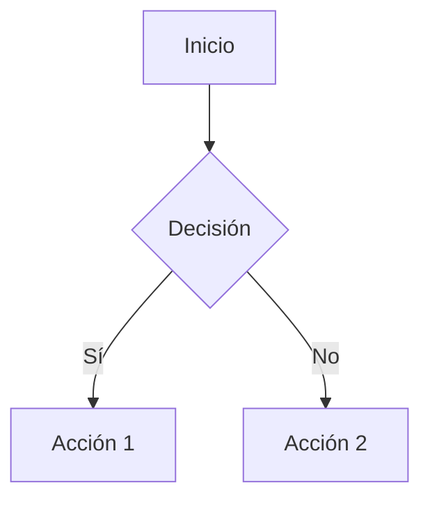
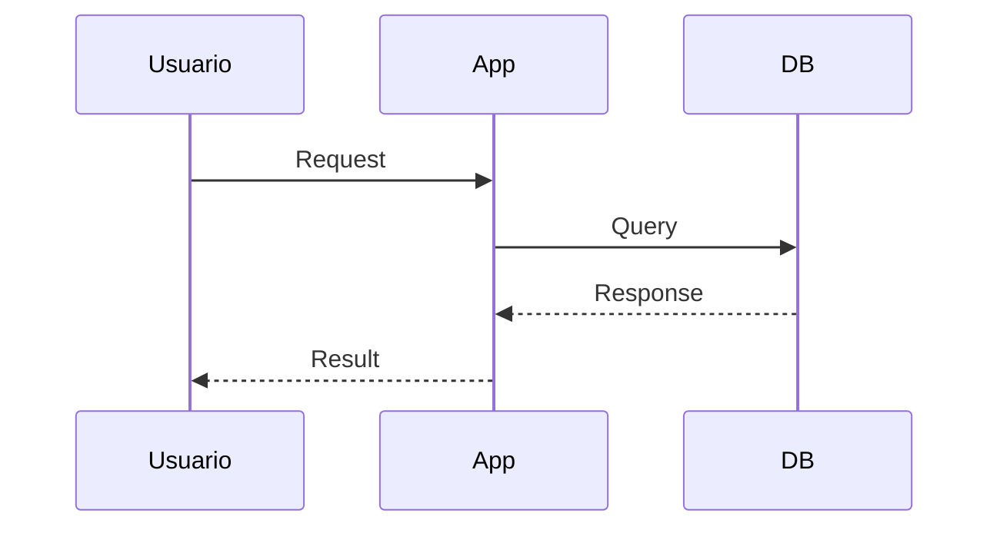
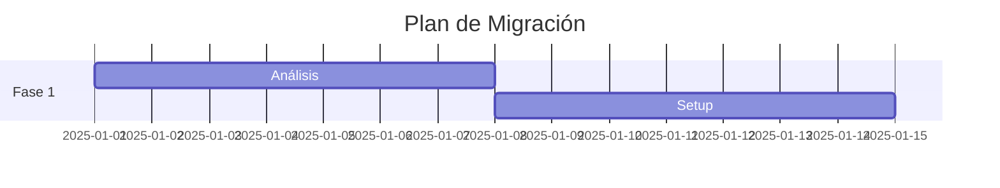

# Guía de Estilo - Documentación de Modernización

## Reglas de Formato

### Separadores
**❌ NO USAR** separadores horizontales (`---`)
- Son de mal gusto y rompen el flujo visual
- La jerarquía de títulos es suficiente para estructurar

**✅ USAR** jerarquía de títulos:
```markdown
# Título Principal
## Sección Principal
### Subsección
#### Detalle Específico
```

### Estructura de Documentos

#### Documento Principal (*_MODERNIZATION.md)
```markdown
# [Aplicación] - Propuesta de Modernización y Migración a AWS
## [Subtítulo descriptivo]

**Metadatos clave**

## 🎯 Contexto
### ¿Qué es [Aplicación]?
### Situación Actual

## 🏗️ Arquitectura Actual (AS-IS)


## 💡 Arquitectura Propuesta (TO-BE)
### Opción 1: [Recomendada]
### Opción 2: [Alternativa]

## 📊 Análisis de Costos


## 🚀 Plan de Migración


## 📋 Checklist de Migración
## ⚠️ Riesgos y Mitigaciones
## 📈 Beneficios
## 🔐 Seguridad
## 📚 Documentación
## 🎯 Recomendación Final
## 📞 Próximos Pasos
```

#### README.md
```markdown
# [Aplicación] - Modernización y Migración a AWS

## 📁 Contenido
## 🎯 Resumen Ejecutivo
## 📊 Comparación de Opciones
## 🚀 Próximos Pasos
## 📞 Contacto
```

#### RESUMEN_EJECUTIVO.md
```markdown
# [Aplicación] - Resumen Ejecutivo
## Propuesta de Modernización a AWS

**Metadatos**

## 📊 Situación Actual
## 💡 Propuesta Recomendada
## 💰 Análisis Financiero
## ✅ Beneficios Clave
## 📅 Timeline de Implementación
## ⚠️ Riesgos y Mitigaciones
## 🎯 Comparación de Opciones
## 📋 Recursos Necesarios
## 🚀 Próximos Pasos
## 📞 Contactos
## 🎓 Preguntas Frecuentes
## ✍️ Aprobaciones Requeridas
## 📎 Anexos
```

### Uso de Emojis
**✅ USAR** emojis en títulos para mejorar escaneo visual:
- 🎯 Contexto/Objetivos
- 🏗️ Arquitectura
- 💡 Propuestas/Ideas
- 📊 Análisis/Datos
- 💰 Costos/Financiero
- 🚀 Implementación/Migración
- ⚠️ Riesgos/Advertencias
- ✅ Beneficios/Checklist
- 📋 Listas/Inventarios
- 🔐 Seguridad
- 📚 Documentación
- 📞 Contacto
- 🎓 Capacitación
- 📈 Mejoras/Optimización

### Tablas
**✅ USAR** tablas para comparaciones y datos estructurados:
```markdown
| Concepto | Actual | Propuesto | Diferencia |
|----------|--------|-----------|------------|
| Costo    | $X     | $Y        | -Z%        |
```

### Diagramas

**CRÍTICO: Tipos de Diagramas**

#### Diagramas de Arquitectura
**✅ USAR MCP Diagram Server** (Python diagrams):
```markdown

```

**Casos de uso:**
- Arquitectura de infraestructura (actual/propuesta)
- Componentes AWS y on-premise
- Topología de red
- Distribución de servicios

**Tipos requeridos:**
1. `[app]_current_architecture.png` - AS-IS
2. `[app]_aws_modernized.png` - TO-BE
3. `[app]_comparison.png` - Comparación visual
4. `[app]_migration_flow.png` - Flujo de migración (si es arquitectura)

#### Diagramas de Flujo y Secuencia
**✅ USAR sintaxis Mermaid**:

**Flowchart:**
```markdown

```

**Sequence:**
```markdown

```

**Gantt (Timeline):**
```markdown

```

**Casos de uso:**
- Procesos de negocio
- Flujos de aprobación
- Secuencias de migración
- Timelines de proyecto
- Diagramas de decisión

#### Regla de Decisión
```
¿Es arquitectura de infraestructura/servicios?
├─ SÍ → MCP Diagram Server (Python diagrams)
└─ NO → Mermaid syntax
    ├─ ¿Es flujo/proceso? → flowchart
    ├─ ¿Es secuencia? → sequenceDiagram
    └─ ¿Es timeline? → gantt
```

### Listas
**✅ USAR** checkboxes para tareas:
```markdown
- [ ] Tarea pendiente
- [x] Tarea completada
```

**✅ USAR** símbolos para estados:
```markdown
✅ Completado
⏳ En progreso
❌ No recomendado
⚠️ Advertencia
```

### Código y Comandos
**✅ USAR** bloques de código con sintaxis:
```markdown
```bash
aws ec2 describe-instances
```
```

### Énfasis
**✅ USAR** negritas para conceptos clave:
```markdown
**Importante**: Texto destacado
```

**❌ NO ABUSAR** de negritas o cursivas

### Secciones de Costos
**✅ INCLUIR** siempre:
- Costo mensual y anual
- Desglose detallado
- Comparación con situación actual
- ROI y tiempo de recuperación
- Ahorro porcentual

### Secciones de Timeline
**✅ INCLUIR**:
- Duración total
- Desglose por semanas/fases
- Entregables por fase
- Recursos necesarios

### Metadatos Iniciales
**✅ INCLUIR** al inicio:
```markdown
**Fecha**: YYYY-MM-DD
**Aplicación**: Nombre
**Tipo**: Categoría
**Estrategia**: Lift & Shift | Modernización | Replatform
**Timeline**: X semanas
```

## Tono y Lenguaje

### Estilo
- **Profesional** pero accesible
- **Técnico** cuando sea necesario
- **Conciso** y directo al punto
- **Accionable** con pasos claros

### Evitar
- ❌ Jerga innecesaria
- ❌ Explicaciones excesivamente largas
- ❌ Ambigüedades
- ❌ Promesas sin fundamento

### Preferir
- ✅ Datos concretos
- ✅ Ejemplos específicos
- ✅ Comandos ejecutables
- ✅ Referencias a documentación oficial

## Consistencia

### Nombres
- Mantener nombres consistentes de servicios AWS
- Usar nombres oficiales (no abreviaturas inventadas)
- Capitalizar correctamente (CloudWatch, no cloudwatch)

### Unidades
- Costos: siempre en USD con 2 decimales
- Tiempo: semanas para proyectos, días para tareas
- Recursos: vCPU, GB RAM, GB storage
- Porcentajes: con símbolo % pegado al número

### Fechas
- Formato: YYYY-MM-DD
- Ejemplo: 2025-12-11

## Checklist Pre-Publicación

Antes de considerar un documento completo, verificar:

- [ ] Sin separadores HR (`---`)
- [ ] Jerarquía de títulos correcta
- [ ] Todos los diagramas generados e incluidos
- [ ] Análisis de costos completo con ROI
- [ ] Timeline detallado
- [ ] Riesgos identificados y mitigados
- [ ] Próximos pasos claros
- [ ] Metadatos completos
- [ ] Links a diagramas funcionando
- [ ] Tablas bien formateadas
- [ ] Código con sintaxis correcta
- [ ] Emojis en títulos principales
- [ ] Consistencia en nombres y términos

## Ubicación de Archivos

```
modernization-proposals/
├── [aplicacion]/
│   ├── [APLICACION]_MODERNIZATION.md
│   ├── README.md
│   ├── RESUMEN_EJECUTIVO.md (opcional)
│   └── diagrams/
│       └── generated-diagrams/
│           ├── [app]_current_architecture.png
│           ├── [app]_aws_modernized.png
│           ├── [app]_comparison.png
│           └── [app]_migration_flow.png
└── templates/
    └── STYLE_GUIDE.md (este archivo)
```

## Actualización

**Última actualización**: 2025-12-11  
**Versión**: 1.0  
**Mantenedor**: Equipo de Arquitectura AWS

Esta guía debe actualizarse cuando se identifiquen nuevas mejores prácticas o patrones recurrentes.
